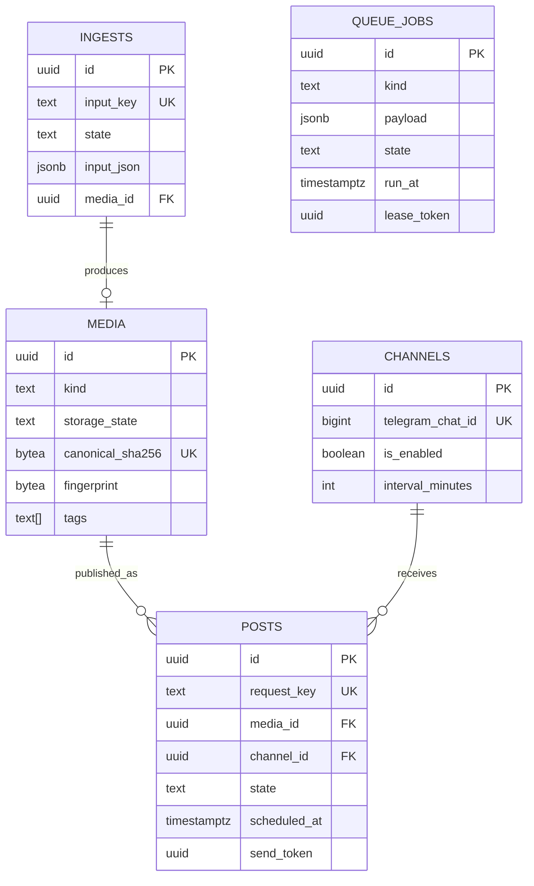
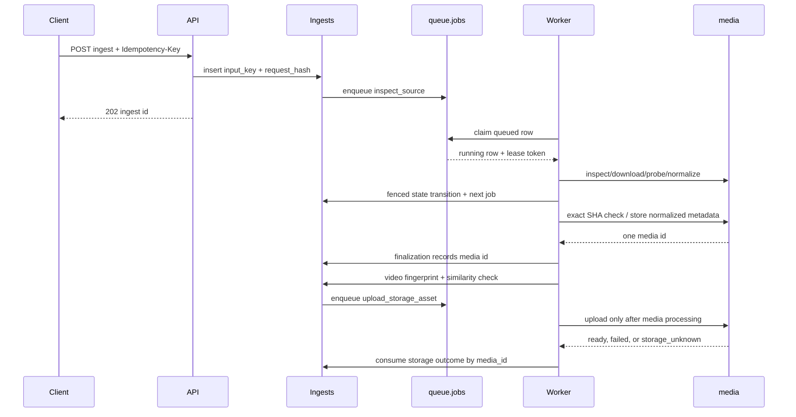

# Current architecture

sooqa is a modular monolith. `apps/server` owns HTTP and Telegram composition,
`apps/worker` owns durable-job execution, and `apps/companion` is an optional
local capture process. The crates are compile-time boundaries inside those
processes; they are not separate network services.

## Durable model

PostgreSQL is the source of truth. The initial migration creates exactly five
application tables:

`_sqlx_migrations` is migration bookkeeping; it is not application state.
There are no compatibility tables, copy migrations, generic idempotency table,
Telegram receipt table, or automatic volume reset. A local database created by
the previous model must be explicitly recreated by the owner before applying
this baseline.

## Boundaries

- `sooqa-inbox` validates source submissions and defines typed ingest metadata.
- `sooqa-library` defines media, source, tag, and storage domain values.
- `sooqa-publisher` defines channels, posts, and publication transitions.
- `sooqa-jobs` defines typed job kinds and payloads. Persistence decodes the
  JSON envelope once; handlers receive a typed `JobCommand`.
- `sooqa-media` owns direct HTTP, ffprobe, ffmpeg, image normalization,
  hashing, fingerprints, workspaces, and subprocess safety.
- `sooqa-telegram` owns Telegram protocol mapping and storage upload effects.
- `sooqa-persistence` owns migrations and short database transactions.
- `sooqa-api` owns HTTP routing, one configured bearer secret, limits, and
  stable request-ID errors.

## Ingest and worker flow

The current worker keeps the existing direct-media stages while the persistence
reset lands: source inspection, download, probe, normalization, finalization,
and video fingerprinting are separate typed jobs. Each stage updates `ingests`
and enqueues its successor in a short transaction. For video, storage is not
enqueued until fingerprinting and similarity checking have completed; this
makes media-processing order explicit rather than racing storage against it.
Network and subprocess work never runs while that transaction is open. Stage
metadata is bounded JSON input metadata; it is decoded into typed Rust structs
at the handler boundary. Storage completion/failure is applied by `media_id`,
and attach/reset/mark-unknown reconcile the linked ingest rows.

A queue claim creates a fresh owner, expiry, and fencing token. Heartbeats and
completion/retry/failure updates require all three. Expired leases return to
`queued` (or become `failed` after the attempt limit). A final expired attempt
also marks its owning ingest terminal with an explicit lease-expired error;
an expired storage upload becomes `storage_unknown` unless the media row is
already `ready`. `run_at` is the retry and scheduling clock; there is no
separate retry-wait state.

## Media and storage

`media` is the normalized business item, not a parent with child assets. Its
canonical SHA is unique, its fingerprint is versioned, and `tags` is a bounded
PostgreSQL array with a GIN index. Source and adapter metadata lives in the
bounded `source_metadata` JSON column. Telegram storage is an effect-local
state machine on the same row: `pending_storage`, `ready`,
`storage_unknown`, or `missing`, with generation/token fields for retries and
ambiguous results. Exact-SHA deduplication preserves the first source identity
and only fills missing non-identity metadata from later observations.

## Publisher

Channels hold only target identity, enablement, timezone, window, and interval.
Posts hold the intended message and the latest send result. A scheduled post
is a query over `posts.state = 'queued'`; scheduling assigns `cadence_slot_at`
and enqueues a `publish_post` job referencing the post ID. Send generation and
token fence retries, while `unknown` preserves an ambiguous Telegram outcome
for explicit reconciliation.

## Security and filesystem rules

The API compares the configured bearer secret; no token administration data is
stored in PostgreSQL. Telegram admin IDs remain configuration. Direct HTTP
validates and pins destinations, and external commands receive argument arrays,
bounded output, timeouts, and no shell. Workspaces are derived from UUIDs and
are cleaned only in known paths.
