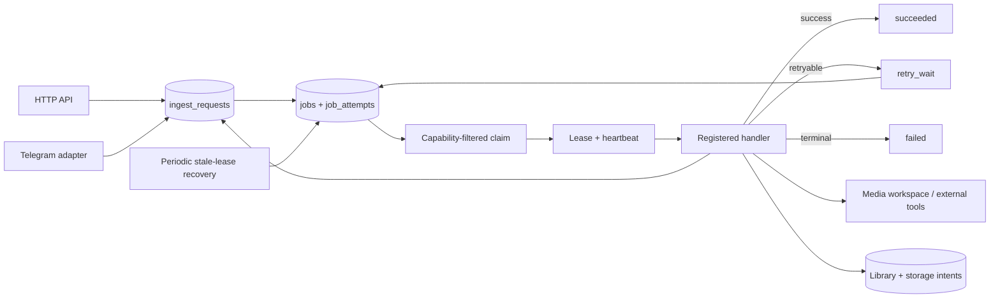
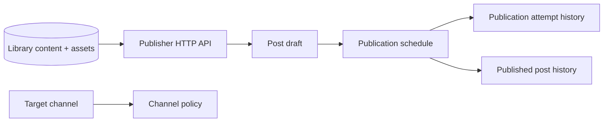

# Current architecture

sooqa is a modular monolith split into independently compiled Rust crates and
three executable applications. The split is for ownership and testability,
not for network deployment: the current processes share one PostgreSQL
database and a configured media work root.

## Boundaries

- `sooqa-inbox` owns ingest requests, their state machine, and durable source
  inspection results.
- `sooqa-library` owns content, media assets, sources, tags, duplicate
  candidates, and storage-upload domain types.
- `sooqa-jobs` owns typed job commands and the job envelope. Persistence
  converts PostgreSQL rows into this domain type; handlers do not read raw
  `payload_json` fields directly.
- `sooqa-media` owns source adapters, ffprobe/ffmpeg boundaries, image work,
  workspaces, hashing, and duplicate media primitives. External commands use
  argument arrays and bounded output.
- `sooqa-telegram` owns Telegram protocol mapping, authorization, update
  receipts, media download staging, and storage upload behavior.
- `sooqa-persistence` owns PostgreSQL migrations and repositories. It is the
  only boundary that performs durable state changes.
- `sooqa-api` owns HTTP routes, bearer-token scopes, stable errors, and request
  limits.
- `sooqa-publisher` owns publication domain types and state transitions for
  target channels, channel policies, post drafts, schedules, attempts, and
  published-post history. The Telegram publication handler is not composed
  yet.

`apps/server` composes HTTP, Telegram polling, and configuration.
`apps/worker` composes registered job handlers and the durable worker loop.
`apps/companion` is the optional local capture process.

## Durable job flow

A worker advertises the exact `JobType` values for which it has handlers.
`claim_next` filters by that capability list, so an uncomposed future job stays
queued instead of being failed as `handler_not_registered`. A claimed job is
`running` with an owner, expiry, and heartbeat timestamp. The worker renews
the lease about every third of its lease duration, recovers stale leases at
startup and periodically, and requeues active work on graceful shutdown.

The handler future and database transaction are separate. A handler changes
durable state before or after external work using idempotent repository
operations; no PostgreSQL transaction remains open while Telegram, ffprobe,
ffmpeg, or yt-dlp is running.

## Current ingest paths

URL messages call the Inbox service and create a durable `inspect_source` job.
The production worker registers that handler with a direct-only router:
recognizable media responses stay on the SSRF-hardened direct HTTP adapter,
while page-like responses are rejected as unsupported. The resulting
`download_source` job writes `source.bin` into the deterministic ingest
workspace, records typed download metadata in the existing ingest request, and
enqueues the existing `probe_asset` job. Download completion and failure are
fenced to the current durable job lease attempt, so a stale worker cannot
overwrite a newer attempt's state. The yt-dlp adapter is implemented
behind the media boundary but is not enabled in the production worker until
its subprocess egress has an equivalent SSRF boundary.
Media messages are downloaded into a per-update workspace, then create a
Telegram ingest request and `probe_asset` job. The probe handler validates the
shared workspace and uses ffprobe before recording typed probe metadata and
atomically enqueuing the existing `normalize_asset` job. Probe-derived media
kind is authoritative when it is identifiable; Telegram MIME type and
filename are hints used only when probing is inconclusive. Documents with
missing or generic Telegram metadata are still admitted to probing, while
explicitly unsupported documents are rejected before download. The normalization
handler dispatches from the typed source media kind. Videos use the canonical
ffmpeg profile, output validation, and SHA-256 hashing; images use the existing
bounded JPEG/PNG normalizer, which also creates a thumbnail. Both paths record
typed normalization metadata and atomically enqueue `finalize_ingest`.
Finalization uses the existing exact-dedup/library repository to create or
reuse the canonical content item, asset, source record, and (for images)
thumbnail asset, then enters `fingerprinting` and queues the typed
`compute_fingerprint` job. The video handler extracts the versioned
`frame_dhash_v1` fingerprint from the canonical normalized video in the
isolated workspace and stores it in the existing ingest JSON metadata. Videos
then enter `similarity_check` and queue the typed `check_similarity` job. That
handler decodes the persisted fingerprint at the boundary, compares it with
fingerprints from completed video content, and upserts scored evidence into
the existing `duplicate_candidates` table before completing the request.
Images skip the video-only stages and complete normally. This metadata
placement is an interim schema-compatible composition until the planned
fingerprint repository slice. Similarity thresholds are currently supplied as
the typed `SimilarityConfig` default by the worker composition; a separate
configuration slice can expose them without changing the persistence schema.
The existing storage-upload job remains queued for a capable Telegram worker.
Audio, animation, and unknown media remain terminal `unsupported_media_kind`
cases until their dedicated normalization paths are implemented.

Storage uploads use an idempotency record as a durable intent bound to the
asset, job, provider, storage chat, and upload generation. A reservation has
an owner token and a renewable expiry. A worker defers when another live owner
holds the intent, so that coordination does not consume job attempts. A
successful upload completes the intent in the same short transaction as the
storage object; an API/persistence uncertainty marks it `unknown`. Expired
pending reservations become `unknown` before another attempt can observe them.
Unknown intents are never silently reset: an operator uses the storage-intent
CLI to inspect, acknowledge, reset, or attach the externally created object.
Reset locks the intent and old job, preserves the old job as history, and
creates a new upload generation with a new idempotency key. Attach accepts only
Telegram result fields and derives the asset, provider, and media kind from
the locked durable intent and canonical asset.

## Publisher API and foundation

The Publisher boundary now exposes authenticated draft and scheduling commands on
top of durable state:

The API requires `publisher:read` or `publisher:write`, checks that content is
active with an uploaded canonical asset, and checks that the target channel is
enabled. Draft create/edit commands use the shared `idempotency_records` table;
schedule commands use the schedule's durable idempotency key. Editing uses the
existing optimistic `updated_at` field, and ready drafts are atomically moved to
scheduled by persistence. The always-on server runs a configured scheduler tick:
it locks pending due schedules with `SKIP LOCKED`, re-checks the target and
draft, applies the channel's minimum interval and daily limit, and atomically
creates one deterministic `publish_post` job while moving the schedule to
`queued`. A cadence violation moves `publish_at` to the next UTC-eligible time.
No HTTP command or scheduler tick calls Telegram. The remaining composition is
the Telegram publication handler. Publication attempts retain Telegram request
keys and responses, and an ambiguous result moves the schedule out of the
automatic retry queue until it is explicitly reconciled. Successful publication
records the attempt, schedule, draft, and Telegram message history in one
transaction.

## Filesystem and subprocess safety

Every media job gets a restrictive workspace under `media.work_root`; workspace
helpers allow only fixed areas and safe file names. Direct HTTP, yt-dlp, and
Telegram downloads write to same-directory temporary files and publish only
after validation. ffmpeg normalization follows the same pattern. The shared
publication helper never overwrites a destination: a retry reuses it only when
the existing regular file has identical validated content. Temporary paths
are guarded for drop/cancellation cleanup, and worker startup scavenges old
known temporary names only in non-live job workspaces after checking active
database leases.

Unix external commands run in an owned process group; timeout and cancellation
terminate the group with a short TERM grace period followed by KILL and reap
the direct child. Non-Unix builds use the direct-child fallback until a native
Job Object implementation is added.

The current worker composition requires ffprobe and ffmpeg. It does not
preflight yt-dlp until a handler requiring it is enabled. The container image
includes all three tools and creates a writable `/var/lib/sooqa/work`.

## State of the pipeline

Implemented primitives and boundaries do not imply an end-to-end publisher.
The current ingest path reaches scored duplicate candidates for videos and
normalizes images into the Library. Publisher persistence is now ready for
review-facing actions and scheduling, and the server now enqueues due publish
jobs; the remaining composition work is the Telegram publication handler. The
historical roadmap in
`docs/reference/PROJECT_SPEC.md` is useful context but is not the authority for
those claims.
