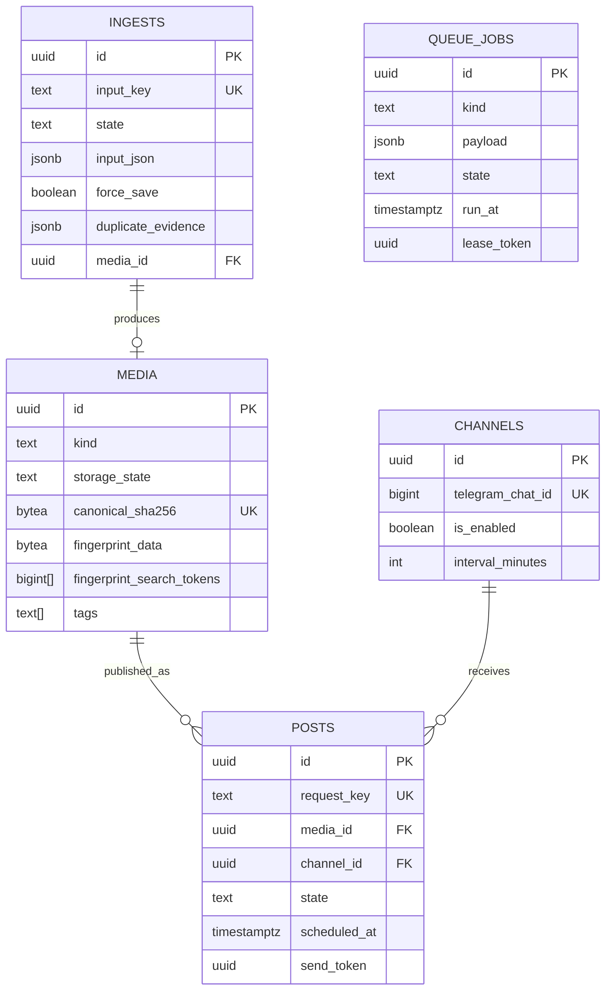
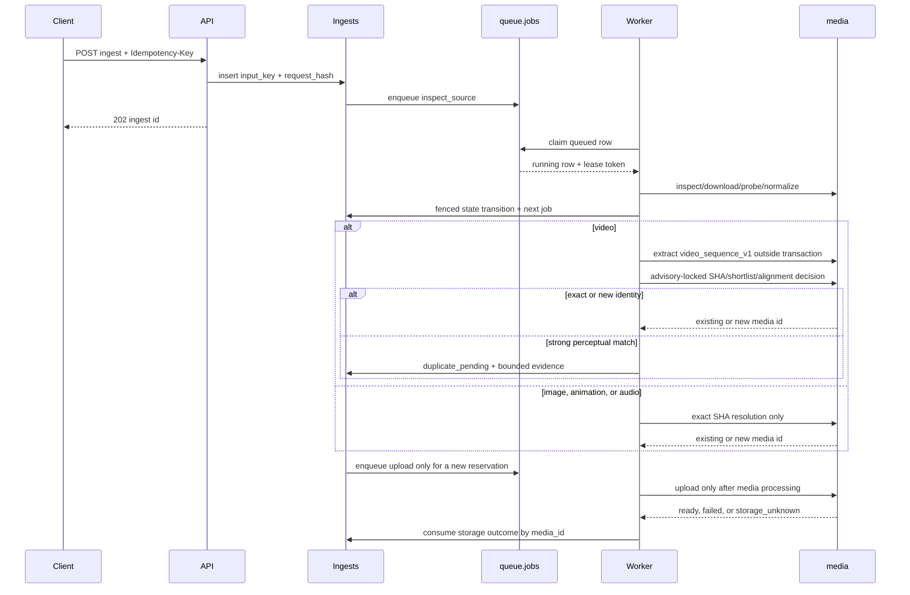

# Current architecture

sooqa is a modular monolith. `apps/server` owns HTTP and Telegram composition,
`apps/worker` owns durable-job execution, and `apps/companion` is an optional
local capture process. The companion exposes one authenticated loopback
submission route and has no database, media, Telegram, or job dependencies.
The crates are compile-time boundaries inside those processes; they are not
separate network services.

## Durable model

PostgreSQL is the source of truth. The initial migration creates exactly five
application tables:

`_sqlx_migrations` is migration bookkeeping; it is not application state.
There are no compatibility tables, copy migrations, generic idempotency table,
Telegram receipt table, or automatic volume reset. A local database created by
the previous model must be explicitly recreated by the owner before applying
this baseline.

## Boundaries

- `sooqa-inbox` validates source submissions and defines typed ingest metadata.
- `sooqa-library` defines media, source, tag, and storage domain values.
- `sooqa-publisher` defines channels, posts, and publication transitions.
- `sooqa-jobs` defines typed job kinds and payloads. Persistence decodes the
  JSON envelope once; handlers receive a typed `JobCommand`.
- `sooqa-media` owns direct HTTP, ffprobe, ffmpeg, image normalization,
  hashing, fingerprints, workspaces, and subprocess safety.
- `sooqa-telegram` owns Telegram protocol mapping and storage upload effects.
  Polling, downloads, and storage uploads use separate HTTP clients and
  timeout policies.
- `sooqa-persistence` owns migrations and short database transactions.
- `sooqa-api` owns HTTP routing, one configured bearer secret, limits, and
  stable request-ID errors.

## Ingest and worker flow

When the video identity gate records `duplicate_pending`, the administrator
can inspect it with `/duplicates` in the configured private bot chat. The bot
renders at most three persisted candidates per ingest: ready candidates have
an `Open media` link and `Use this` action, pending candidates have a `Use
this` action with a storing label, and every card has `Save anyway`. Each
callback is checked against the configured administrator and private chat
before the durable command runs. Telegram callback queries are acknowledged
before repository work so a slow database operation does not leave the client
spinner active.

The HTTP equivalent is
`POST /api/v1/ingests/{id}/accept-duplicate` with `{ "media_id": "..." }`.
The repository locks the ingest row, verifies that the media ID is in the
persisted bounded evidence, locks the candidate media row, and accepts only
`ready` or `pending_storage`. A ready candidate completes immediately. A
pending candidate moves the ingest to `storing` and joins the candidate's
existing storage lifecycle without inserting another media row or upload job.
Incoming supplied tags are unioned into the existing media row and a nonempty
supplied description replaces its description. The same row lock fences
force-save, so a concurrent decision has one winner and the loser receives a
stable conflict; repeating the winning decision is idempotent.

The worker keeps source inspection, download, probe, normalization,
fingerprinting, and exact finalization as separate typed jobs. Each stage
updates `ingests` and enqueues its successor in a short transaction. Video
identity finalization takes one transaction-scoped advisory lock, rechecks the
canonical SHA, asks PostgreSQL for at most twenty plausible fingerprint
candidates, and runs bounded Rust alignment before inserting media. The lock
does not cover download, ffmpeg, filesystem, HTTP, or Telegram work. Images,
animations, and audio skip the video path and use exact SHA resolution. No
storage job is enqueued for `duplicate_pending`; force-save sets the durable
override, reconstructs URL/Telegram source artifacts when necessary, and then
resumes normalization/fingerprinting. Network and subprocess work never runs
while an identity transaction is open. Stage metadata is
bounded JSON input metadata; it is decoded into typed Rust structs at the
handler boundary. Storage completion/failure is applied by `media_id`, and
attach/reset/mark-unknown reconcile the linked ingest rows.

Each successful ingest stage commits its ingest transition, successor enqueue,
and current queue-job success atomically. Final-attempt recovery therefore
fails an owning ingest only when that success transaction never committed.

A queue claim creates a fresh owner, expiry, and fencing token. Heartbeats and
completion/retry/failure updates require all three. The video identity
finalizer also revalidates the live lease inside its media/evidence/storage
transaction, so a stale worker can neither insert media nor leave duplicate
evidence or an upload job behind. Expired leases return to `queued` (or become
`failed` after the attempt limit). A final expired attempt
also marks its owning ingest terminal with an explicit lease-expired error;
an expired storage upload becomes `storage_unknown` unless the media row is
already `ready`. `run_at` is the retry and scheduling clock; there is no
separate retry-wait state.

## Media and storage

`media` is the normalized business item, not a parent with child assets. Its
canonical SHA is unique, its fingerprint is versioned, and `tags` is a bounded
PostgreSQL array with a GIN index. Source and adapter metadata lives in the
bounded `source_metadata` JSON column. Telegram storage is an effect-local
state machine on the same row: `pending_storage`, `ready`,
`storage_unknown`, or `missing`, with generation/token fields for retries and
ambiguous results. Exact-SHA deduplication preserves the first source identity
and only fills missing non-identity metadata from later observations.

The issue #44 implementation stores `video_sequence_v1` as bounded binary
`fingerprint_data` plus a partial-GIN-searchable token array. PostgreSQL only
shortlists compatible `pending_storage` and `ready` video rows; bounded Rust
alignment produces at most three scalar evidence matches, capped at 16 KiB.
Exact duplicates reuse the existing media row, strong perceptual matches stop
at durable `duplicate_pending`, and no-match videos insert one
`pending_storage` reservation before upload.

Duplicate acceptance does not create a UI/session/history table. The
`duplicate_evidence` JSON on `ingests` is the only candidate decision record;
once accepted it is cleared and the chosen `media_id` becomes the durable
decision. Storage completion and failure continue to fan out by that media ID,
so an accepted pending candidate completes or fails with the candidate's own
upload result.

The home deployment adds the official `tdlib/telegram-bot-api` service in
`--local` mode. It is built at a pinned upstream commit, has a dedicated
persistent working volume, and is reachable only as
`http://telegram-bot-api:8081` on the Compose network. The application server
and worker share the sooqa work-root volume with each other; the Bot API data
volume is separate. Telegram downloads and uploads remain path-based or
streamed, so large files do not enter JSON or a `Vec<u8>`. Cloud/local bot
cutover is an owner-authorized operational procedure, never an application
state transition.

## Publisher

Channels hold only target identity, enablement, timezone, window, and interval.
Posts hold the intended message and the latest send result. A scheduled post
is a query over `posts.state = 'queued'`; scheduling assigns `cadence_slot_at`
and enqueues a `publish_post` job referencing the post ID. Send generation and
token fence retries, while `unknown` preserves an ambiguous Telegram outcome
for explicit reconciliation.

## Security and filesystem rules

The API compares the configured bearer secret; no token administration data is
stored in PostgreSQL. Telegram admin IDs remain configuration. Direct HTTP
validates and pins destinations, and external commands receive argument arrays,
bounded output, timeouts, and no shell. Workspaces are derived from UUIDs and
are cleaned only in known paths.
